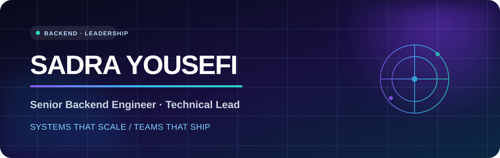

<p align="center">
  
</p>

<p align="center">
  <a href="https://www.linkedin.com/in/sadra-yousefi"></a>
  <a href="mailto:sadra.mty@gmail.com"></a>
  <a href="https://t.me/sadrayousefi"></a>
  
</p>

## Hey, I'm Sadra 👋

I'm a **Senior Backend Engineer & Technical Lead** based in Tehran. I turn complex business domains into reliable production systems — from digital health and insurance workflows to financial market data, industrial IoT, and automation platforms.

I stay hands-on with architecture and code while leading cross-functional teams across backend, frontend, AI, and DevOps.

```text
What I care about:  clear boundaries · resilient services · observable systems · teams that ship
```

### Impact at a glance

- 🏥 Leading the architecture of a digital health and insurance platform with visits, medical records, payments, and coverage-aware workflows.
- 👥 Managing a **7-person cross-functional engineering team** while owning backend and DevOps direction.
- 📈 Built market-data pipelines and candlestick analytics on **PostgreSQL + TimescaleDB** for trading products.
- 🏭 Developed industrial IoT services, real-time **OPC** communication, and low-code automation workflows.
- 🚀 Led an internal venture-building initiative that moved a traditional B2B operation toward scalable B2C channels.

## My engineering toolbox

<p align="center">
  
</p>

| Area | I work with |
| --- | --- |
| **Backend architecture** | Node.js, NestJS, TypeScript, REST APIs, microservices, API gateways, Clean Architecture, CQRS |
| **Data systems** | PostgreSQL, TimescaleDB, MongoDB, Redis, TypeORM, Prisma, query optimization, time-series pipelines |
| **Async & messaging** | RabbitMQ, Kafka, BullMQ, event-driven workflows, background jobs |
| **Platform & delivery** | Docker, GitLab CI/CD, Nginx, Linux, reverse proxies, monitoring, deployment automation |
| **Leadership** | Technical strategy, system design, team leadership, product-oriented engineering, cross-functional delivery |

## Selected open-source work

<table>
  <tr>
    <td width="50%" valign="top">
      <h3><a href="https://github.com/SadraYousefi/docktail">🐳 Docktail</a></h3>
      <p>A friendly Electron dashboard for following and managing Docker logs without living in the terminal.</p>
      <p><code>Electron</code> <code>JavaScript</code> <code>Docker</code></p>
    </td>
    <td width="50%" valign="top">
      <h3><a href="https://github.com/SadraYousefi/web3-scam-check">🛡️ Web3 Scam Check</a></h3>
      <p>A browser extension that helps flag suspicious Web3 pages while you browse.</p>
      <p><code>Browser Extension</code> <code>JavaScript</code> <code>Web3</code></p>
    </td>
  </tr>
  <tr>
    <td width="50%" valign="top">
      <h3><a href="https://github.com/SadraYousefi/Devtools-extension">🧰 Devtools Extension</a></h3>
      <p>A practical browser toolbox that keeps frequently used developer utilities close at hand.</p>
      <p><code>TypeScript</code> <code>Browser APIs</code> <code>Developer Tools</code></p>
    </td>
    <td width="50%" valign="top">
      <h3>🔬 Currently exploring</h3>
      <p>AI-assisted engineering, production-grade agentic workflows, and better ways to operate distributed systems.</p>
      <p><code>AI</code> <code>Automation</code> <code>Distributed Systems</code></p>
    </td>
  </tr>
</table>

## Experience snapshot

```text
2025 — now    Technical Lead              Digital Health & Insurance
2024 — 2025   Venture Builder / Tech Lead Digital Transformation & E-commerce
2023 — 2024   Backend Developer           Market Data & Trading Analytics
2023          Backend Engineer            Industrial IoT & Low-Code Platforms
2020 — now    Technical Consultant        Backend, Automation & DevOps
```

## GitHub, in numbers

<p align="center">
  
  
</p>

---

<p align="center">
  <b>Building systems that scale — and teams that enjoy shipping them.</b><br />
  Open to thoughtful conversations about backend architecture, technical leadership, and ambitious products.
</p>
